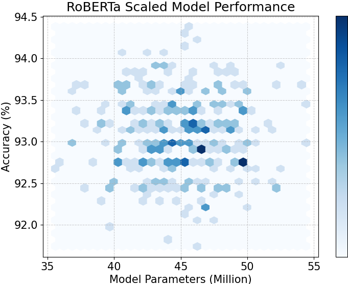
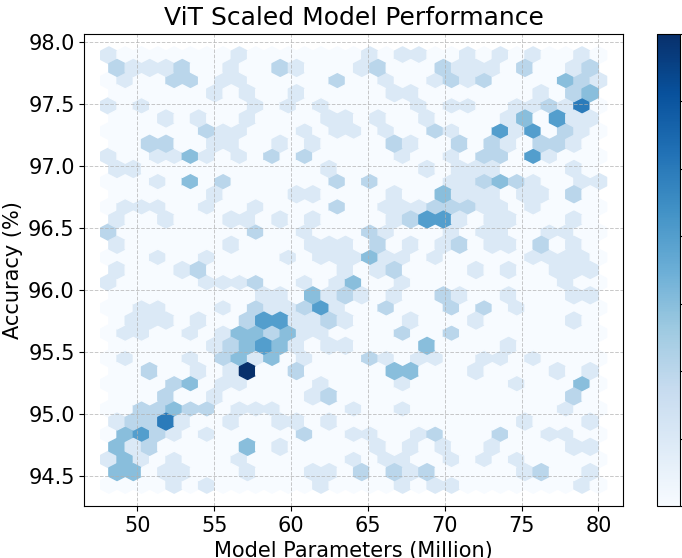

# Post-training High-performance Resource-aware Model Evaluation

## Experiment Goal

In this experiment we show:

**Post federated training, FMs trained by RaFFM is scalable, and we can generate surprisingly large number of scaled FMs (> $10^{10}$) without further training**

Most importantly, such scaled FMs are **high-performance**, which can fit different resource-constraints at the edge.

This is very important in FL, that means for a newly join client with resource constraint, RaFFM can quickly deploy a high-performance model to it without additional training

## Reproduce the Experiments

### Installation

Refer the detailed [installation guide](../../README.md).

```bash
conda create -n raffm python=3.10
conda activate raffm
conda install pytorch torchvision torchaudio pytorch-cuda=12.1 -c pytorch -c nvidia
pip install -r requirements.txt
```

### Download the scalable FM checkpoints

We provide resource-aware FMs checkpoints trained via FL. You can download here:

- [ViT-base CIFAR-100 _large-budget_](https://drive.google.com/drive/folders/1SnmA-K0etMGK8hLZVXJC0HNQbPbkPd0c?usp=sharing) [Trained on *Large-budget* system heterogeneity edge-FL with 100 clients]
- [ViT-base CIFAR-10 _large-budget_](https://drive.google.com/drive/folders/1gd_RHZYX-YSYk56dO2oo8wqqSIUD41vb?usp=sharing) [Trained on *Large-budget* system heterogeneity edge-FL with 100 clients]
- [ViT-base CIFAR-10 _small-budget_](https://drive.google.com/drive/folders/1_vOgDe8nj5NZ3fyBC3AaRfRsUGDbUAbH?usp=sharing) [Trained on *Small-budget* system heterogeneity edge-FL with 100 clients]
- [BERT-base SST-2 _small-budget_](https://drive.google.com/drive/folders/18F3oywR5licIdhQ4HhR-ev4Hrs9FwtlV?usp=sharing) [Trained on *Small-budget* system heterogeneity edge-FL with 100 clients]

### Run the Experiments

We provide a Jupyter Notebook Tutorial **[post_training_deployment.ipynb](./post_training_deployment.ipynb)** with detailed instruction and high level APIs to reproduce our experiments.

## Results

We have some simple meta results shown on the tutorial: **[post_training_deployment.ipynb](./post_training_deployment.ipynb)**

|  |  |
| :-------------------------------------------------------------------: | :-------------------------------------------------------------------: |
|                   Fig.1 - Scalable RoBERTa on SST-2                   |                    Fig.2 - Scalable ViT on CIFAR10                    |

Figure 1 shows the trained RoBERTa on SST-2 dataset, we sample resource-aware scaled submodel in different size, and evaluate without further training, all submodels get the same level of accuracy.

Similarlly, in Figure 2, we show the trained scalable ViT's performance on CIFAR-10, notebally, with half of the parameter scaled out, submodels with 45M parameters (75% FLOPs reduction) achieves 94.5% accuracy without further training.

In summry, Foundation Models trained by RaFFM are scalable, which can enables heterogeneous model deployment post-federated learning without further training.
