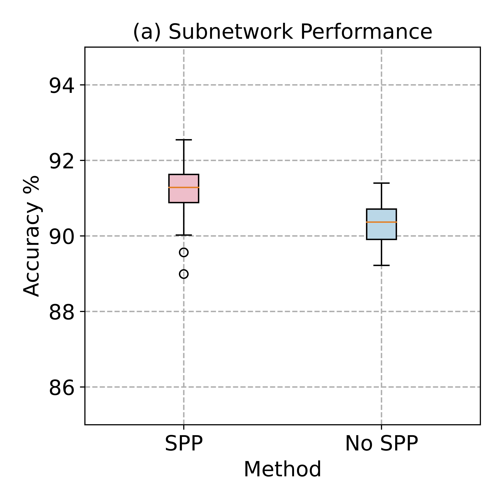
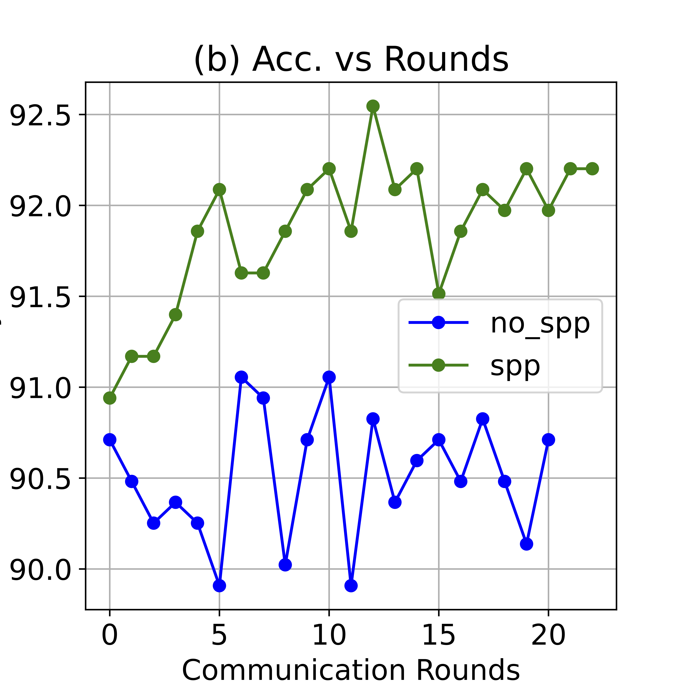

# Salient Parameter Prioritization (SPP)

## Experiment Goal

In this experiment we show:

- **The novelty and nessisity of RaFFM's specialized SPP**
- **RaFFM SPP preserves the pre-trained knowledge in FMs**
- **Comparison with Standard Pruning-Based Weights Ranking**

## Reproduce the Experiments

### Installation

Refer the detailed [installation guide](../../README.md).

```bash
conda create -n raffm python=3.10
conda activate raffm
conda install pytorch torchvision torchaudio pytorch-cuda=12.1 -c pytorch -c nvidia
pip install -r requirements.txt
```

### Run the Experiments

We provide a Jupyter Notebook Tutorial **[salient_parameter_prioritization](./salient_parameter_prioritization.ipynb)** with detailed instruction and high level APIs to reproduce our experiments.

## Experiment setting

We use Vision Transformer (ViT) as base fundation mdoel in this experiments, and we leverage standard rank-based pruning algorithm compare with RaFFM's specialized salient parameter prioritization.

We first perform the parameter prioritization use different method, and then compare the ranked FMs's performance on dowmstream tasks and comparison with original FMs.

Detailed instructions and hyperparameters please refer our tutorial **[salient_parameter_prioritization](./salient_parameter_prioritization.ipynb)**, where we have detailed instruction and high level APIs to reproduce our experiments.

## Results

We compare the ViT prioritized by RaFFM with **standard pruning-based rank** and **original ViT**.

<table>
  <caption style="text-align: center;">Table 1. Comparison of Model Performance With SPP</caption>

  <tr>
    <th rowspan="2">Model</th>
    <th rowspan="2">Method</th>
    <th colspan="2">Cifar10</th>
    <th colspan="2">Cifar100</th>
    <th colspan="2">Flower102</th>
  </tr>
  <tr>
    <th>Accuracy</th>
    <th>F1</th>
    <th>Accuracy</th>
    <th>F1</th>
    <th>Accuracy</th>
    <th>F1</th>
  </tr>
  <tr>
    <td rowspan="3">ViT-base</td>
    <td>Original FM</td>
    <td>96.70%</td>
    <td>96.26%</td>
    <td>84.50%</td>
    <td>84.30%</td>
    <td>98.20%</td>
    <td>97.85%</td>
  </tr>
  <tr>
    <td>Pruning-Rank</td>
    <td>48.82%</td>
    <td>46.53%</td>
    <td>15.40%</td>
    <td>14.88%</td>
    <td>55.60%</td>
    <td>54.70%</td>
  </tr>
  <tr>
    <td>RaFFM SPP</td>
    <td>96.78%</td>
    <td>96.53%</td>
    <td>85.20%</td>
    <td>85.00%</td>
    <td>98.50%</td>
    <td>98.10%</td>
  </tr>
</table>

The comparison results is shown in Table 1.

The experimental results shows:

- Standard pruning based SPP will destroy the pre-trained knowledge captured by the attention mechanism of FMs

- RaFFM SPP preserves the pre-trained knowledge in FMs, leading to better model performance and faster learning convergence

- FMs applied RaFFM’s Specialized SPP produces competitive performance as original FMs

Further more we conducted ablation studies.
In FL senarios, RaFFM equiped with SPP significantly improve the performance versus original FM (not apply SPP). The results is shown in Figure 1 and 2.

|  |  |
| :--------------------------------------------------: | :------------------------------------------------------------: |
|           Fig.1 - Local model performance            |                  Fig.2 - Training stableness                   |

The experiment is conducted on BERT-Large with SST-2.
RaFFM leverages the salient parameter prioritization component to identify impactful weights in FMs. Figure 1 box plot shows the local sub-model performance range for randomly sampled 100 clients from supernet with the same resource constraints. Figure 2 shows the communication rounds vs model accuracy. It's evident that SPP have positive impact on FL process, and produced higher model performance and a more stable learning trend.
