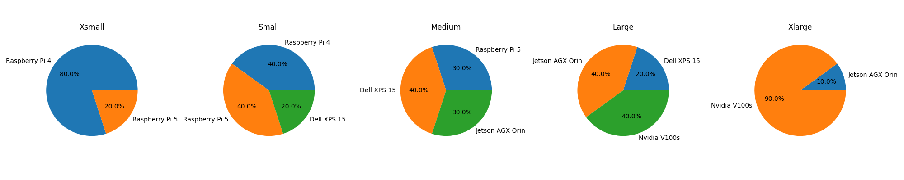

# System Heterogeneity Setting

## Edge devices

We have 5 different types of IoT end-devices involving in our experiment settings.

- Nvidia V100s
- Jetson AGX Orin
- Dell XPS 15
- Raspberry Pi 5
- Raspberry Pi 4

## System Heterogeneity Setting

Specified in our experiments, we have 5 distinct system heterogeneity settings: **_XSmall_, _Small_, _Medium_, _Large_, _XLarge_**, and each of them have 100 clients.

Intuitively, the configuration of each systems are as shown in Figure 1.

<figure>
    
    <figcaption  style="text-align: center;">Fig.1 - System settings.</figcaption>
</figure>

_Note: we are reusing some end-devices as the participate clients to save the budget_

Specifically, configuration of each systems are:

- Xsmall: 80% Raspberry Pi 4, 20% Raspberry Pi 5.
- Small: 40% Raspberry Pi 4, 40% Raspberry Pi 5, 20% Dell XPS 15.
- Medium: 30% Raspberry Pi 5, 40% Dell XPS 15, 30% Jetson AGX Orin.
- Large: 20% Dell XPS 15, 40% Jetson AGX Orin, 40% Nvidia V100s.
- Xlarge: 10% Jetson AGX Orin, 90% Nvidia V100s.

## Hyper-parameter settings

The hyper-parameter settings slightly varies for different FMs, in the `arguments.py` we have detailed hyper-parameter setting lists.
Here is the general settings:

```ini
[general]
n_clients = 100
communication_rounds = 500
participate_rate = 0.1

[algo]
aggregate = fedavg
sampler = random

[dataset]
partition = noniid-labeldir
beta = .5
train_bs = (4,64)(varies on devices)
test_bs = 128
n_worker = {varies on devices}

[optimization]
lr = 5e-5
optimizer = adam
lr_scheduler = ExponentialLR
local_epochs = 4

```
